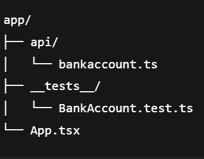
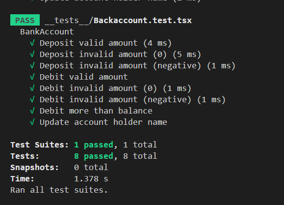

# Bank Account App

A simple **Bank Account application** implemented in TypeScript.
Allows users to manage a bank account by depositing and debiting money, as well as updating the account holder's name. TThe main purpose of this app is to practice **unit testing** using **Jest** by implementing a basic `BankAccount` class and writing tests for its core functionalities.

---

## Features

- Deposit money into the account
- Debit money from the account
- Validate invalid operations (e.g., negative or zero amounts, overdraft)
- Update account holder name
- Display account holder name and current balance

---

## Project Structure

---

## BankAccount Class

The `BankAccount` class includes:

- `deposit(amount: number)`: Adds the amount to balance. Throws an error for invalid amounts.
- `debit(amount: number)`: Subtracts the amount from balance. Throws an error for invalid amounts or insufficient balance.
- `getBalance()`: Returns the current balance.
- `updateHolderName(name: string)`: Updates the account holder's name.

**Constants:**

- `INSUFFICIENT_BALANCE`: Error message for overdraft attempts.
- `WRONG_AMOUNT`: Error message for invalid deposit/debit amounts.

---

## Testing

This project uses **Jest** for unit testing.

### What was tested

- **Deposit functionality**
  - Deposit valid amounts
  - Deposit invalid amounts (0 or negative)
- **Debit functionality**
  - Debit valid amounts
  - Debit invalid amounts (0, negative, or more than balance)
- **Update account holder name**

> Each test checks a **single behavior** of the `BankAccount` class in **isolation**, which qualifies as **unit testing**.

### Example Test Cases

| Test Case                           | Description                            |
| ----------------------------------- | -------------------------------------- |
| Deposit valid amount                | Adds a valid amount to the balance     |
| Deposit invalid amount (0/negative) | Throws `WRONG_AMOUNT` error            |
| Debit valid amount                  | Subtracts a valid amount from balance  |
| Debit invalid amount (0/negative)   | Throws `WRONG_AMOUNT` error            |
| Debit more than balance             | Throws `INSUFFICIENT_BALANCE` error    |
| Update account holder name          | Changes the name of the account holder |

### Test Results

All tests passed successfully:

# bank-account-unit-test
